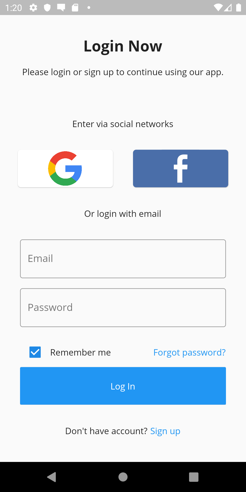

# Portfolio using Flutter


Original Design
https://dribbble.com/shots/5642059-Login-and-Sign-Up-Page-Free-download-Adobe-XD

<div style="display:flex;flex-direction:row;">
        
        
</div>


### Steps
1. Clone the repository with the 'clone' command, or just download the zip.

```
$ git clone https://github.com/madz/flutter_portfolio.git
```

2. Install dependencies from pubspec.yaml by running `flutter packages get` from the project root (see [using packages documentation](https://flutter.io/using-packages/#adding-a-package-dependency-to-an-app) for details and how to do this in the editor). 

3. Go to the Firebase Console and then to the Authentication section and then
     on to the "Sign-in method" tab an enable Email/Password, Facebook and Google Sign in methods.

### Android integration 
1. Follow [Option 1 instructions here up to Step 3](https://firebase.google.com/docs/android/setup#console). Be sure to configure your SHA-1 or SHA-256 hash in the Firebase Project Settings for your app.
 
2. Download 'google-services.json' file from your Firebase project and place it in your
     projects <flutter-project>/android/app directory.

### iOS integration 
1. Follow [Option 1 instructions here up to Step 3](https://firebase.google.com/docs/ios/setup#console)
2. Download 'GoogleService-Info.plist' file from your Firebase project and place it in your
     projects <flutter-project>/ios/Runner directory.

